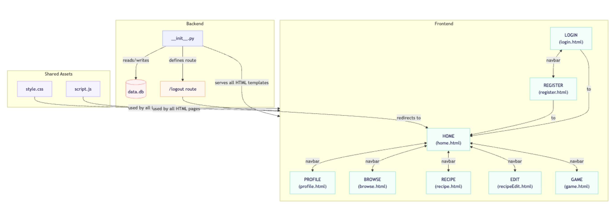
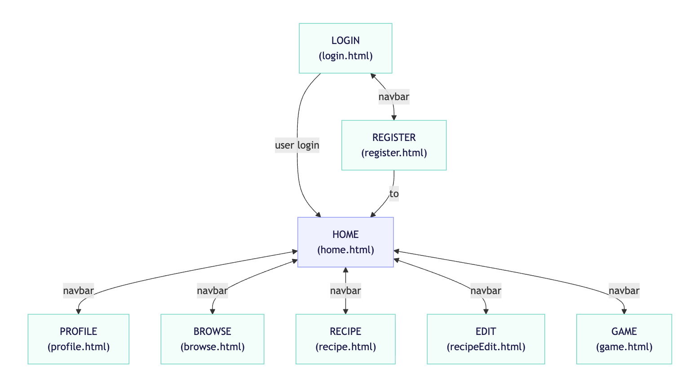

# System Blueprint (_a.k.a._ "Design Doc")

## TNPG: TACOS
## project: P05 Le Fin
## Target ship date: 2026-05-30

---

#### roster:

| Name | Email | Primary Role | Secondary Role |
|---|---|---|---|
|Ashley Li|ashleyl503@nycstudents.net|PM| - |
|Naomi Kurian|naomik30@nycstudents.net|Primary VM| - |
|Isabel Zheng|isabelz13@nycstudents.net|Secondary VM| - |
|Veronika Duvanova|veronikad7@nycstudents.net|Tertiary VM|Scribe|

---

# Summary
We are creating a collaborative recipe sharing application where a user can share their recipes as well as find recipes based on the foods they have at home.

## Problem Being Solved
The problem being solved is the difficulty of finding recipes that you're able to follow with the ingredients you have at hand.

## Target Users

Who will use this system?

- Beginner level cooks
- People with limited access to food products
- Intermediate level cooks looking to share their recipes

## Why This Project Matters
This project makes cooking accessible to anyone who wants to experiment with a new recipe or produce something out of the ingredients they have accessible to them with minimal to no food shopping needed.

---

# Minimum Viable Product (MVP) Scope

## Core Features (Required for Final Submission)
Features that **must** be completed:
1. The ability to post/share a recipe
2. The ability to browse all recipes
3. The ability to search up specific recipes based on recipe title / ingredients

## Stretch Features (Only if MVP is Complete)
1. The ability to have a profile and see your shared / saved recipes
2. A game / something entertaining for the user to do
3. Use of API for imagery

## Explicit Non-Goals

Features intentionally excluded:
- Direct communication between users
- Nutrient specifics
- Ingredients page

---

# Technology Stack

| Layer | Selected Tool |
|---|---|
| Backend Framework | Flask |
| Frontend Framework | Tailwind |
| Database | SQLite |
| Authentication | Flask sessions |
| ORM / DB Library | n/a |

## Why This Stack Was Chosen
We chose flask because it provides smooth transition between app calls, selected tailwind because we have higher familiarity with the framework, selected SQLite because it serves our purpose well (recipes don't require complex database).

---

# Team Ownership Plan

Each member must own meaningful deliverables.

| Team Member | Primary Ownership | Secondary Ownership | Specific Deliverables |
|---|---|---|---|
|Ashley|Frontend|Visual Design|search bar|
|Naomi|Backend|Styling|Login/register, recipe html pages|
|Isabel|Backend|Example accounts|profile page, browsing page|
|Veronika|Backend|Visual Design|home html, game html|

---

# Component map

# Site map

## Key User Stories
### eg0
As a low-income mom, I want to find recipes with food I already own so that I'm not wasting it and letting it go bad.

### eg1
As a intermediate chef, I want to share recipes so that people of any cooking level can follow along.

### eg2
As a student, I want to find quick recipes so that I can make a quick meal to eat after class.

# Database Design

||USERS||
|---|---|---|
|INTEGER|userid|PK|
|TEXT|username||
|TEXT|password||
|INTEGER|contributions||
|TEXT|ingredients||
|TEXT|favorites||
---
||RECIPE||
|---|---|---|
|TEXT|id|PK|
|Naomi|author|FK|
|TEXT|name||
|TEXT|description||
|TEXT|ingredients||
|TEXT|pic||
|TEXT|difficulty||
|TEXT|instructions||
---

# Testing Plan
1. Work with a single VM at the beginning, we want to be able to sync user profiles with recipes. Each user should be set up with a password, username, and potentially status (active, not online, or completely offline).
2. After databases are set up, information saved, testing the blog-like recipe inputs the user makes & ensuring these are stored properly.

# Timeline
## Week 1 Goals: Set up users page (use it as the foundation) and organize databases. 
## Week 2 Goals: Implement the user recipe inputs setting, making it viewable to everyone. 
## Week 3 Goals: Use an API to suggest recipes with the user-provided ingredients and accessibility. 

## Internal Deadlines: Always make sure that there's something running without bugs. [DAILY GOAL]

| Team Member | Name | Details | Deadline |
|---|---|---|---|
|Naomi|Login|Set up basic login html and route|5/12/2026|
|Naomi|Register|Set up basic register html and route|5/12/2026|
|Veronika|Home|Set up basic home html and navbar|5/13/2026|
|Ashley|Logout|Set up logout route|5/12/2026|
|Isabel|Game|Set up game html|5/15/2026|
|Ashley|DB|Set tables in dbs|5/12/2026|
|Veronika|Filtering|Implement filtering and search bar|5/16/2026|
|Veronika|Styling|Set up basic tailwind|5/16/2026|
|Isabel|Styling|Add custom css|5/16/2026|

# Completion Criteria (_a.k.a._ "Definition of 'Done'")
Project is considered complete when all of the following are true:
1. User can publish recipes
2. User can browse through recipes (with search tool)
3. User can list ingredients and find matching recipes

# Open Questions
What is the meaning of life if not eating?

# Appendix
N/A

# Other
N/A
